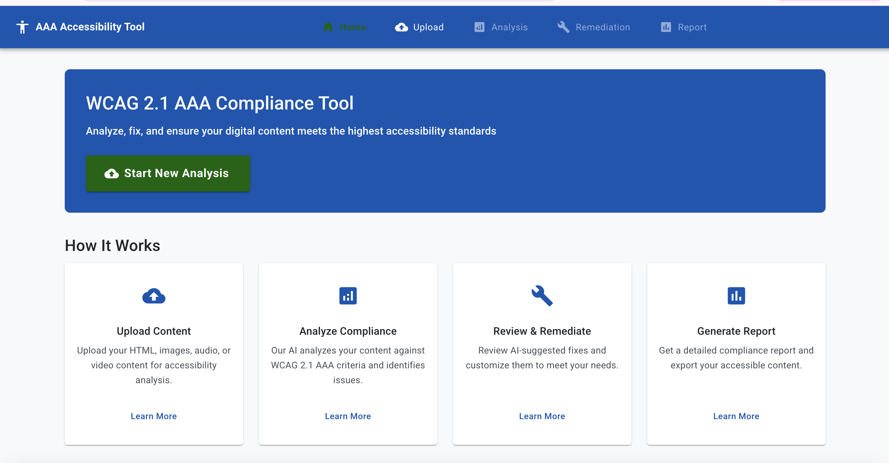
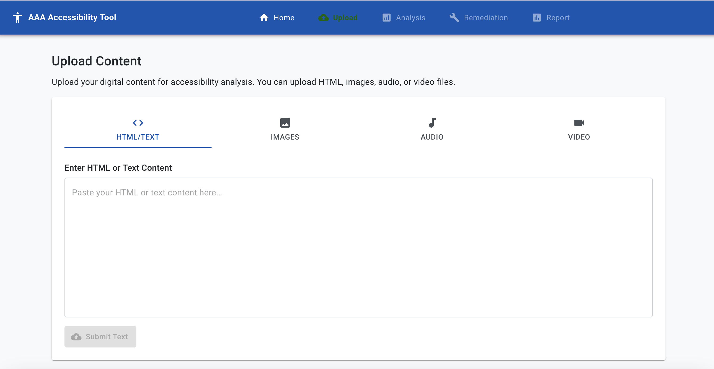
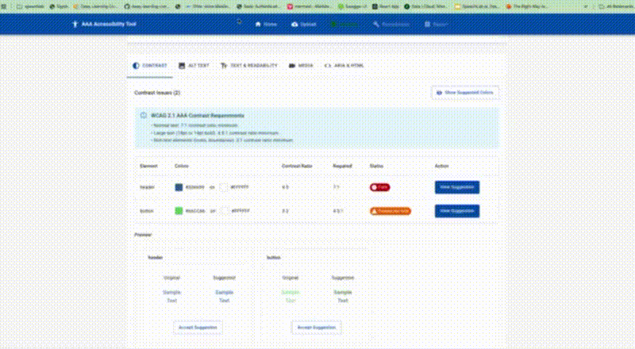

# Web3 Accessibility Protocol (WAP): WCAG 2.1 AAA Compliance for Decentralized Applications

> "The power of the Web is in its universality. Access by everyone regardless of disability is an essential aspect." - Tim Berners-Lee, W3C Director and inventor of the World Wide Web

*The Web3 Accessibility Protocol extends this vision to the decentralized web, ensuring blockchain applications are accessible to all.*





## Demo

Check out our demo showcasing the Web3 Accessibility Protocol in action:

<!-- This animated GIF autoplays in GitHub with native resolution (640x352) and maximum quality -->


**For the highest quality experience:**
- **[⬇️ Download the original MOV video](./AAA-Accessibility-App/images/aaademo.mov?raw=true)** (3.6MB, original source)
- **[⬇️ Download the ultra-high quality MP4 video](./AAA-Accessibility-App/images/aaademo.mp4?raw=true)** (1.4MB, CRF 12, 5Mbps video, 1024kbps audio)

<details>
  <summary>About the video quality</summary>
  
  We've preserved the highest possible quality in all formats:
  - The GIF maintains the native 640x352 resolution with optimized color palette and advanced dithering
  - The MP4 uses extremely high quality settings (CRF 12, 5Mbps video bitrate, 1024kbps audio)
  - The original MOV file is provided for absolute maximum quality
</details>

## Why We Built This

In a world where Web3 and decentralized applications are reshaping our digital landscape, true inclusion means ensuring everyone can access and use blockchain-based content, regardless of ability. The Web3 Accessibility Protocol was created with a simple yet powerful mission: to break down digital barriers and make decentralized applications truly accessible for all.

People with disabilities face unnecessary obstacles in the crypto and Web3 space every day - from blind users unable to navigate NFT marketplaces without proper descriptions, to deaf users missing critical information in uncaptioned crypto explainer videos, to users with cognitive disabilities struggling with complex DeFi interfaces. These barriers aren't just inconveniences; they represent real exclusion from the financial freedom, ownership, and opportunities that Web3 promises.

By building this tool, we aim to empower Web3 developers, dApp creators, and blockchain organizations to create truly inclusive decentralized experiences that meet the highest accessibility standards (WCAG 2.1 AAA). We believe that accessibility isn't just about compliance—it's about human dignity, equal opportunity, and the fundamental right to participate in the decentralized future.

Together, we can build a more accessible Web3 ecosystem, one dApp at a time.

## Overview

This application helps you scan, analyze, and remediate Web3 content (dApp interfaces, NFT metadata, smart contract interactions, etc.) to meet or closely approximate WCAG 2.1 AAA success criteria. It provides an intuitive interface for:

- Ingesting various Web3 content types (dApp interfaces, NFT collections, token dashboards, etc.)
- Diagnosing accessibility issues based on WCAG 2.1 AAA criteria
- Automating fixes wherever possible (AI-generated NFT alt text, DeFi interface improvements, etc.)
- Allowing user review of all AI-suggested improvements
- Outputting updated content with detailed compliance reporting and on-chain verification

## Features

### Contrast (Enhanced) for Token Interfaces
- Analyzes text and non-text contrast in wallet interfaces and dApps against WCAG 2.1 AAA requirements
- Automatically suggests improved colors that meet AAA requirements for better token visualization
- Provides side-by-side previews of original and suggested colors for DeFi dashboards

### NFT & Non-Text Content
- Detects missing or inadequate alt text in NFT collections
- Generates AI-based alt text with context sensitivity for digital assets
- Identifies decorative elements in dApps that should have empty alt attributes
- Flags complex blockchain visualizations that may need long descriptions

### Video & Audio for Web3 Education
- Generates transcripts for crypto podcasts and educational content
- Creates synchronized captions for blockchain explainer videos
- Provides placeholders for sign language interpretation in Web3 webinars
- Suggests extended audio descriptions for visual DeFi tutorials

### Smart Contract Readability
- Analyzes smart contract interface complexity and suggests simplifications
- Identifies unusual blockchain terminology and provides definitions
- Detects technical abbreviations and suggests expansions
- Adds pronunciation guidance for crypto terms where needed

### Robust ARIA & HTML for dApps
- Validates markup with proper ARIA attributes for Web3 applications
- Ensures semantic correctness for assistive technologies interacting with blockchain interfaces
- Checks for proper status messages and notifications during transaction processing

## Technical Architecture

The application is built with a modern Web3-ready tech stack:

### Backend
- Node.js with Express
- RESTful API architecture with blockchain integration capabilities
- AI integration for content analysis and remediation
- IPFS integration for decentralized storage of accessibility metadata

### Frontend
- React with Material UI and Web3 connection libraries
- Responsive design that is itself AAA compliant
- Interactive preview and editing capabilities for blockchain content
- Detailed reporting dashboard with on-chain verification options

## Getting Started

### Prerequisites
- Node.js (v16 or higher)
- npm or yarn
- OpenAI API key (optional, for enhanced AI capabilities)
- Ethereum wallet (for on-chain verification features)

### Installation

1. Clone the repository:
```bash
git clone https://github.com/yourusername/web3-accessibility-protocol.git
cd AAA-Accessibility-App
```

2. Install dependencies:
```bash
npm install
```

3. Create a `.env` file in the root directory with the following variables (copy from `.env.example`):
```
PORT=5000
NODE_ENV=development
OPENAI_API_KEY=your_openai_api_key_here  # Optional
ETHEREUM_RPC_URL=your_ethereum_rpc_url    # Optional, for blockchain features
```

4. Start the development servers:
```bash
npm run dev
```

This will start both the backend server (on port 5000) and the frontend development server (on port 3000).

## Usage

### 1. Upload Web3 Content
- Upload dApp interfaces, NFT collections, or smart contract UIs
- Connect wallet to analyze live blockchain applications

### 2. Analyze Content
- The system will scan your Web3 content for WCAG 2.1 AAA compliance issues
- View detailed analysis results by category with blockchain-specific recommendations

### 3. Review & Remediate
- Review AI-suggested fixes for each issue in your decentralized application
- Accept suggestions or provide your own modifications
- See side-by-side comparisons of original and improved content

### 4. Generate Report & On-Chain Verification
- Get a comprehensive compliance report
- Optionally store accessibility certification on-chain as proof of compliance
- Download the remediated content with accessibility metadata ready for IPFS storage

## Integrating with Web3 Services

The application includes integration points for various Web3 services:

### NFT Metadata Enhancement
Connect to NFT marketplaces to automatically enhance metadata with accessibility information.

### Smart Contract Verification
Verify accessibility compliance and store proof on-chain using our verification smart contracts.

### Decentralized Storage
Store accessibility metadata on IPFS to ensure permanent, decentralized access to accessibility information.

## WCAG 2.1 AAA Coverage for Web3

This tool addresses the following WCAG 2.1 AAA success criteria in the context of Web3 applications:

- 1.4.6 Contrast (Enhanced) for token interfaces and blockchain visualizations
- 1.4.9 Images of Text (No Exception) for NFT collections and crypto assets
- 1.2.6 Sign Language (Prerecorded) for DeFi educational content
- 1.2.7 Extended Audio Description (Prerecorded) for complex blockchain explanations
- 1.2.8 Media Alternative (Prerecorded) for Web3 tutorials
- 1.2.9 Audio-only (Live) for crypto podcasts and AMAs
- 3.1.3 Unusual Words for blockchain terminology
- 3.1.4 Abbreviations for crypto acronyms
- 3.1.5 Reading Level for smart contract interfaces
- 3.1.6 Pronunciation for token names and technical terms

## Project Structure

```
Web3-Accessibility-Protocol/
├─ backend/
│  ├─ controllers/        # API controllers for each feature
│  ├─ routes/             # API route definitions
│  ├─ blockchain/         # Blockchain integration services
│  ├─ uploads/            # Uploaded files storage
│  ├─ index.js            # Main server entry point
│  └─ ...
├─ frontend/
│  ├─ src/
│  │  ├─ components/      # Reusable UI components
│  │  │  ├─ analysis/     # Analysis-specific components
│  │  │  ├─ layout/       # Layout components (header, footer)
│  │  │  ├─ web3/         # Web3 connection components
│  │  │  └─ upload/       # Upload-related components
│  │  ├─ context/         # React context providers
│  │  ├─ pages/           # Page components
│  │  ├─ styles/          # Global styles and theme
│  │  ├─ utils/           # Utility functions
│  │  ├─ App.jsx          # Main application component
│  │  └─ main.jsx         # Entry point
│  ├─ index.html          # HTML template
│  └─ ...
├─ contracts/             # Smart contracts for on-chain verification
├─ .env.example           # Example environment variables
├─ .gitignore             # Git ignore file
├─ package.json           # Project dependencies and scripts
└─ README.md              # Project documentation
```

## Limitations

- Sign language interpretation requires human translators; the tool provides placeholders and guidance
- Some complex accessibility issues may require manual review and remediation
- The tool assists with technical compliance but cannot guarantee legal compliance with accessibility laws
- On-chain verification is subject to gas fees and blockchain network conditions

## Contributing

Contributions are welcome! Please feel free to submit a Pull Request or open an issue.

## License

This project is licensed under the MIT License - see the LICENSE file for details.

## Acknowledgments

- W3C Web Accessibility Initiative (WAI)
- The WCAG 2.1 Guidelines
- OpenAI for AI capabilities
- The Ethereum community for blockchain integration support 
